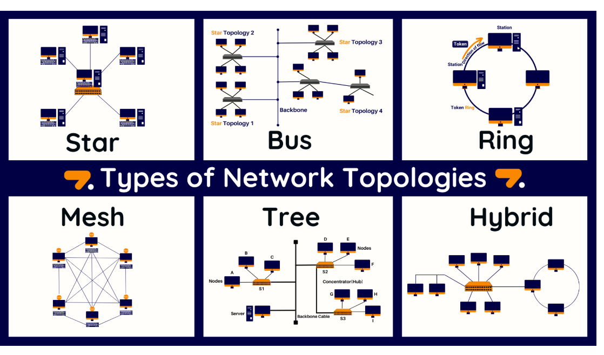

# 09. Network Topologies

## 📌 What is Network Topology?
Network topology is the **arrangement of devices and cables** in a computer network.  
Think of it like the **layout of roads in a city** – it defines how data travels between devices.

---

## 🔑 Types of Network Topologies

### 1. **Bus Topology**
- All devices share a **single backbone cable**.
- If the cable fails → whole network goes down.
- Cheap but outdated.

**Analogy:** Imagine one main road in a village. All houses are connected to the same road. If the road is blocked → no one can move.

---

### 2. **Star Topology**
- All devices connect to a **central hub/switch**.
- If one device fails → others are safe.
- If hub fails → entire network fails.
- Common in home & office networks.

**Analogy:** Like an airport hub – all flights connect through one central airport. If that airport shuts down, all routes are affected.

---

### 3. **Ring Topology**
- Devices form a **circular loop**.
- Data travels in one direction (or both, in dual-ring).
- If one device fails → entire ring may break (unless fault-tolerant).

**Analogy:** Like a metro rail loop around a city. If one track breaks, trains can’t complete the circle.

---

### 4. **Mesh Topology**
- Every device connects to **every other device**.
- Very reliable (no single point of failure).
- Expensive and complex.
- Used in military or mission-critical systems.

**Analogy:** Like multiple roads between all cities. If one road is blocked, traffic takes another route.

---

### 5. **Tree Topology**
- Combination of **star + bus**.
- Devices are grouped into stars, and these stars connect using a bus.
- Scalable but backbone failure impacts the whole network.

**Analogy:** Like a family tree → branches (stars) connected to a trunk (bus).

---

### 6. **Hybrid Topology**
- Combination of two or more topologies.
- Flexible and scalable.
- Used in **large enterprises & ISPs**.

**Analogy:** A modern city has highways (bus), ring roads (ring), and star-like local areas.

---

## 📊 Comparison Table

| Topology   | Cost   | Reliability | Scalability | Use Case |
|------------|--------|-------------|-------------|----------|
| Bus        | Low    | Low         | Poor        | Small labs (old) |
| Star       | Medium | Medium      | High        | Homes, offices |
| Ring       | Medium | Medium      | Limited     | Legacy networks |
| Mesh       | High   | Very High   | Limited     | Military, critical |
| Tree       | Medium | Medium      | High        | Large orgs |
| Hybrid     | High   | High        | Very High   | ISPs, enterprises |

---

## 🖼 Diagram

---

## 🔗 Navigation
[⬅️ Previous (08_Devices.md)](08_Devices.md) | [Next ➡️ (10_OSI_Model.md)](10_OSI_Model.md)
